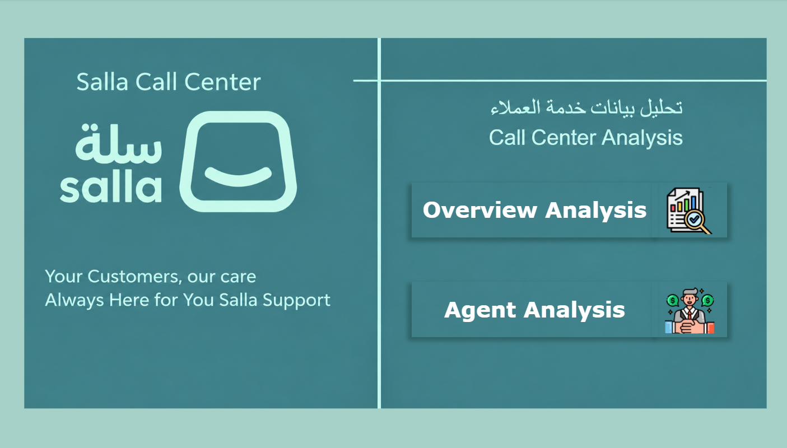
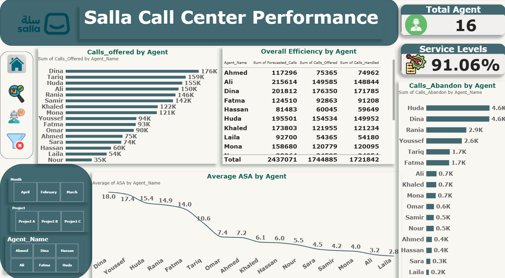

# Salla Call Center Performance Analysis

## Overview

A Call Center Performance Analysis project built using SQL and Power BI to evaluate call volume, service performance, abandoned calls, ASA, and agent performance.

## Tools & Technologies

- SQL
- Power BI
- Data Analysis
- Excel
- Data Visualization

## Key KPIs

- Total Forecasted Calls: 2.4M
- Total Calls Offered: 1.7M
- Total Calls Handled: 1.6M
- Total Calls Abandoned: 23K
- Handling Ratio: 98.68%

## Dashboard

### Home



### Overview Analysis


### Agent Analysis



## Power BI Dashboard

View the interactive dashboard:

[Open Interactive Power BI Dashboard](https://app.powerbi.com/groups/me/reports/c069fc2b-1734-4eb0-9f5b-15a6d438d46f/dc2b19b02a3b65a09dba?experience=power-bi&bookmarkGuid=c462fd939bad38649833)

## Business Insights

- March recorded the highest forecasted call volume at approximately 978K.
- April recorded approximately 755K forecasted calls.
- February recorded approximately 704K forecasted calls.
- March had the highest average abandoned calls.
- Agent-level analysis compares forecasted, offered, and handled calls.


## Project Structure

```text
Salla_Call_Center_Analysis/
│
├── README.md
├── 01_Raw_Data/
├── 02_Cleaned_Data/
├── 03_SQL_Analysis/
├── 04_Business_Insights/
├── 05_PowerBI_Dashboard/
└── Dashboard/
    ├── Home.png
    ├── Overview_Analysis.png
    └── Agent_Analysis.png
